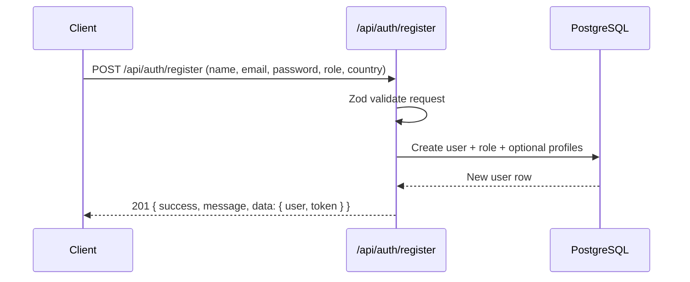
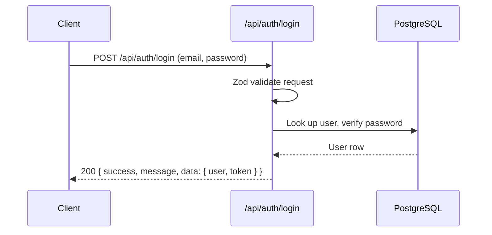
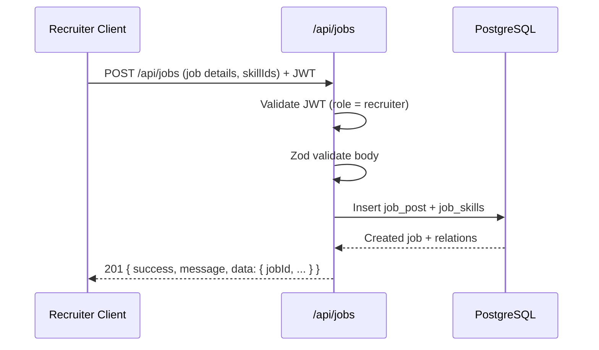
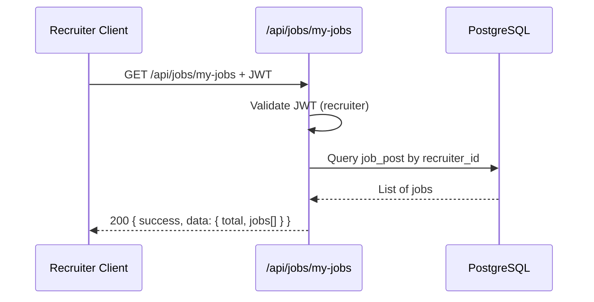
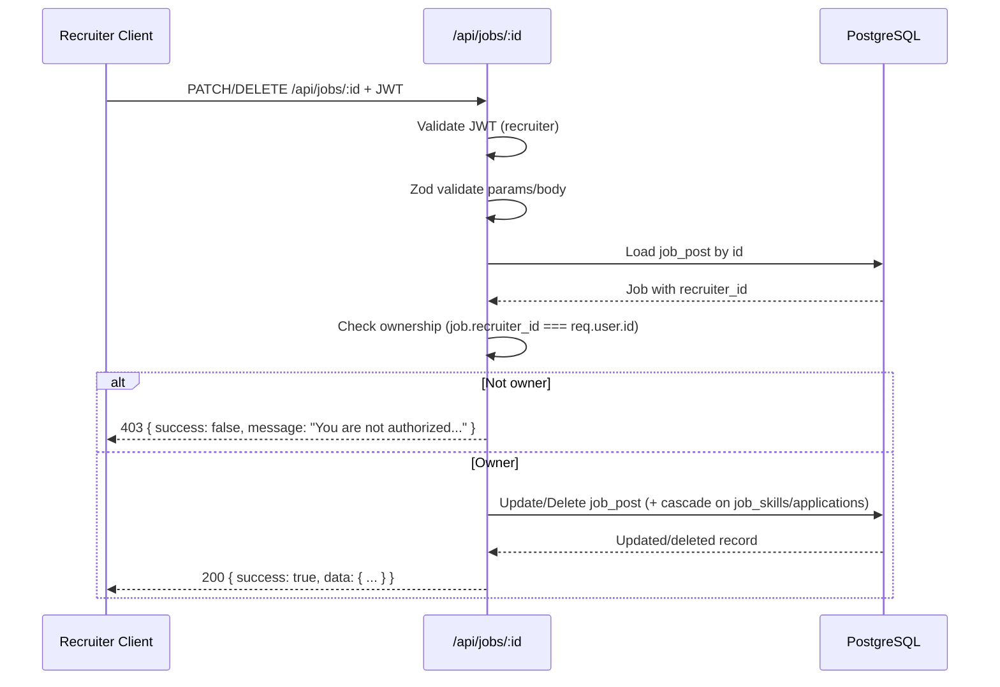
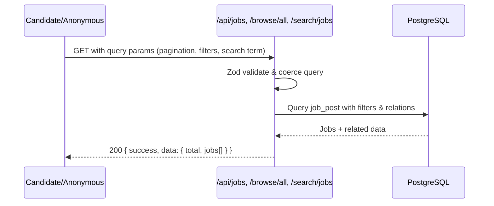
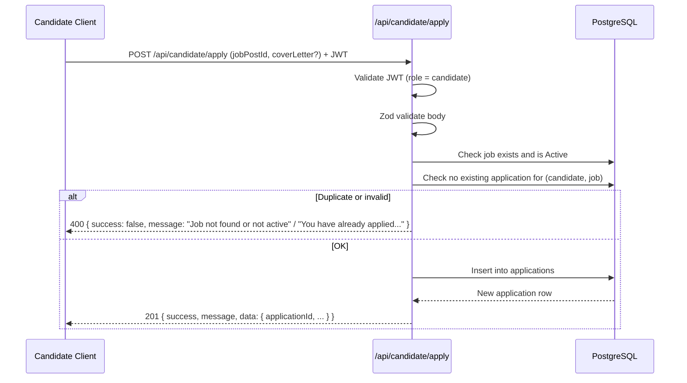

# System Flow – Hiring Platform

This document describes the **end-to-end flows** for the main user journeys in the Hiring Platform:

- Authentication
- Recruiter job lifecycle
- Candidate job discovery & applications

For detailed architecture and component responsibilities, see `ARCHITECTURE_GUIDE.md`.

---

## 1. Authentication Flow

### 1.1 Register

### 1.2 Login

---

## 2. Recruiter Job Lifecycle

### 2.1 Post a Job

### 2.2 View Own Jobs

### 2.3 Update / Delete Job

---

## 3. Candidate Job Discovery & Applications

### 3.1 Browse & Search Jobs

### 3.2 Apply to a Job

---

## 4. Health & Observability

- **Health check**:
  - `GET /api/health` → simple `success` + `timestamp`.
- **Logging**:
  - HTTP logs via Express middleware.
  - Prisma logs for database queries during development.

---

## 5. Where to Go Next

- Detailed architecture, layers, and repository patterns → `ARCHITECTURE_GUIDE.md`
- Route-by-route details (inputs/outputs) → `API_ROUTES_REFERENCE.md`
- Validation rules → `ZOD_REQUIREMENTS.md`
- Standard envelopes & errors → `API_REQUEST_RESPONSE_STRUCTURE.md`

